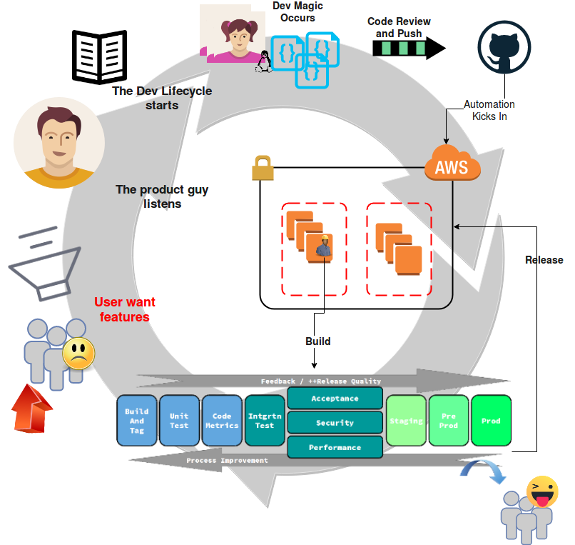

# Enterprise Development and Deployment
## An ECS managed Docker auto scaling CI/CD Pipeline with a Release Environments for AWS

This is a _fully managed_ ECS/Container Driven Continuous Delivery Platform for building, testing and Production deployment. You can add  additonal VPC/Environments such as Staging or QA, delivering steady state Production deployments.

A working, but basic enterprise deployment platform for deploying code in AWS. There is a cenrtal theme of deploying via a Managed Jenkins ECS Cluster.  There's plenty of work to do, incl. security concerns _(caveat emptor)_ - but out of the box with a few configuration steps you get:

* Secure Public / Private  VPC setup with NAT & IGW
* Service Discovery via a Private AWS Hosted Zone

    No more ENV concerns, each VPC has it's own DNS, [db.mydomain.io](#nowhere) is correct in every env/VPC.  Developers don't ever worry about config such as + "_${ENV}" ) 
* A scalable ECS backed managed cluster of Jenkins slaves with a governing master.
* Scalable Node/Javascript build slaves, lifecycle managed by ECS & Jenkins.
* A Jenkins 2.0 Master extended from [jenkins/jenkins](https://hub.docker.com/r/jenkins/jenkins/)  customised to run a build on first boot.
* Jenkins Jobs to Create Deployable Development Environments such as Prod/QA/Staging *
* Sonar for source code analysis
* Nexus Artifactory | NPM Enterprise | <yours_here>
* Easily extensible with new services
* Automatic Peering to new VPCs for Deployment *
* A Bastion Jump Box accessible via
* A VPN
* Cloudwtach Logging for most features
* Multi AZ with EFS & RDS Storage
* Encrypted State with Locking enabled
* Secure keyless Key,Value store

## N.B. Change Passwords and configure/review security for public facing Pipeline components such as Jenkins/Nexus/Sonar

## Quick and Dirty 
```
./go.sh
# Check for error messages, anything that failed will clobber on plan + apply.
terraform apply

➜  aws-pipeline-v2 git:(master) ✗ ssh -i ~/.ssh/my-test-key.pem openvpnas@<pipeline_vpn_ip>
➜  # when all is configured, do a sudo passwd openvpn
➜  # now go to https://pipeline_vpn_ip and login with the openvpn password you just set - download and save config file for next step
➜  aws-pipeline-v2 git:(master) ✗ sudo openvpn --config ~/.ssh/my-test-key.ovpn
➜  aws-pipeline-v2 git:(master) ✗ ssh -i ~/.ssh/my-test-key.pem ec2-user@<pipeline_bastion_private_ip>
# Release
```


## AWS Overview

<a href="https://drive.google.com/uc?export=view&id=0B6rlckp3x7UkZjFTZTBEOTZoeVk"></a>

## Less Tech View

<a href="https://drive.google.com/uc?export=view&id=0B6rlckp3x7UkUDA0NTdNOV9XY0k"></a>

## Initial Setup
```bash
export BUCKET_NAME="my.bucket.unique.id-$(uuidgen)"
export DYNAMO_TABLE="my.bucket.unique.id-lock-$(uuidgen)"
```
Some manual steps at the moment, we're working on these.  Using terraform 0.9.11,  so no workspaces for now.


## Jenkins GitHub Credentials
If you want your pirvate keys available, you need to load them into an S3 bucker #TODO: Set up Keys, and S3 Bucket

## Initialising state and deploying via Terraforming
Install terraform, currently 0.9.11 (working on migration)

### S3/Terraform Backend

```bash
git clone git@github.com:Plnt9/aws-pipeline-v2.git
cd aws-pipeline-v2
terraform get
terraform init
```
[<import state>](#state)

Run an `aws s3 ls` before you start for a sanity check.

#### Manual CLI Steps (or do the same  via Web Console)
1. [Create your `S3` bucket](#s3) for state management, (enable Versioning & encryption) this is the value of bucket in `statefile.tf`
2. [Create your `DynamoDB` instance](#dynamo), again matching the names in `statefile.tf` - same as Step 1
3. [Create a keypair](#keypair), matching the name to the value of `key_name` in `terraform.tfstate` save the .pem file as shown below.


### <a name="state"></a> Importing State
```
terraform import aws_s3_bucket.statefiles_for_app "$BUCKET_NAME"
terraform import aws_dynamodb_table.terraform_statelock "$DYNAMO_TABLE"

```

### Plan and Apply (this will cost money)
```bash
terraform plan
terraform apply
```

### Pipeline Service Images
The docker images are available here:
* [Demo NPM Project](https://github.com/codecrunchers/helloworld-npm) for pipeline build and Deploy
* [Jekins Node/NPM Slave](https://github.com/codecrunchers/jenkins-node-slave)
* [Jenkins Master](https://github.com/codecrunchers/jenkinsci)

Tag and push these to the ecr repositories created. `["pipeline.jenkins", "pipeline.consul", "pipeline.nexus", "pipeline.sonar"]`

### Services
Once these have been pushed, the ALB Endpoint which appeared in the output of `terraform apply` can be accessed from you vpn on:
* Jenkins can be accessed at http://pipeline.<TLD>/jenkins/)
* Sonar can be accessed at http://pipeline.<TLD>/sonar/)
* Nexus can be accessed at http://pipeline.<TLD>/nexus/)

#### VPN
* [OpenVPN AMI Docs] (https://docs.openvpn.net/how-to-tutorialsguides/virtual-platforms/amazon-ec2-appliance-ami-quick-start-guide/)

Manually allow your own ip for a single ssh session. SSH in via the key we produced at the start, and run through the cli prompts - takes about 2 mns. At the end do a `sudo passwd openvpn` - you can now hit the HTTPS port of this machine and download your VPN config file.

We'll likely update this, looking for something cheaper/better integrated

#### Debug Box / Bastion / Jump Box
From there, you can access the Debug box, this has access to the entire VPC.

#### Sonar
You will need to manually configure Sonar for now.  Jenkins has 1 Sonar server configured, https://record.domain.tld/sonar/ (i.e. your ALB)

#### Nexus
Nexius is deployed, but likewise not configured


## AWS Commands for Manual Steps
### <a name="dynamodb"></a> DynamoDB
```bash
aws dynamodb create-table \
    --table-name <statefile.tf.dyanodb.name> \
    --attribute-definitions AttributeName=LockID,AttributeType=S \
    --key-schema AttributeName=LockID,KeyType=HASH \
    --provisioned-throughput ReadCapacityUnits=1,WriteCapacityUnits=1
```

### <a name="s3"></a> S3
`aws s3 mb s3://"$BUCKET_NAME"` (Manually enable & then check for Versioning?) `aws s3api get-bucket-versioning  --bucket <bucket_name_from_statefile.tf>`

### <a name="keypair"></a> Keypair
```bash
aws ec2 create-key-pair --key-name <variables.tf.key_name> --query 'KeyMaterial' --output text > <variables.tf.key_name>.pem
chmod 400 pipeline-ecs.pem
```


## TODO
* Figure out how to regenerate the stack_id each run
* Jobs for VPC Building
* VPC Peering module
* Configure Sonar
* Configure Nexus
* OSS VPN
* SSL
* Encrypt EFS
* Restrict ECS Role Permissions
* lock down VPN
